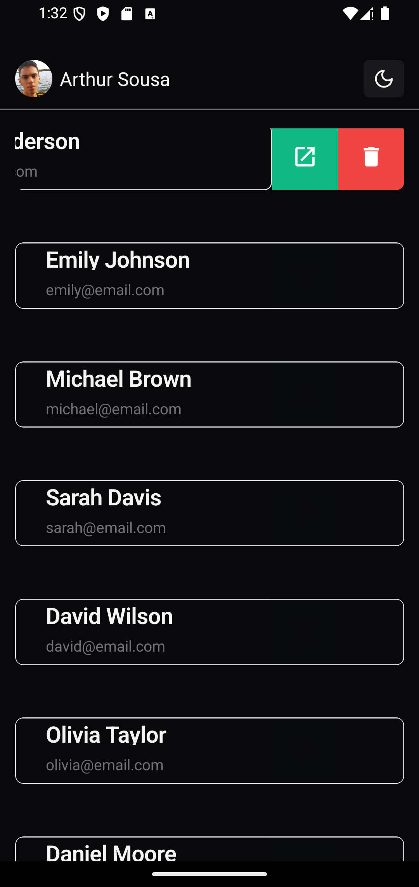
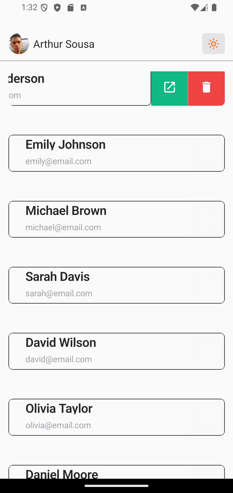

#  Swipeable 

- Aplicação usando React Native
- Usando Expo
- Usando NativeWind
- nativecn-ui
- react-native-gesture-handler
- react-native-gesture-handler/ReanimatedSwipeable

## Rodar o projeto

- primeiro instalar o nodejs versão LTS
- npm install para instalar todas as dependência
- npm start ou npx  expo  start para executar o projeto 